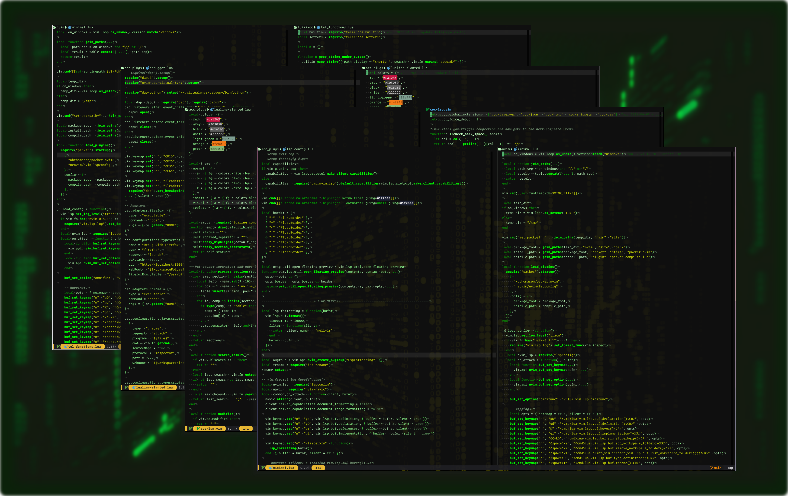

# 🎄 The Matrix Reloaded Theme

The Matrix Reloaded Theme — with full support for treesitter!

## 🤔 Why?

It's The Matrix, so the real question is *Why not?*

## ⚙️ Installation

```vim
Plug 'algoritmau/thematrixreloaded'
...
colorscheme thematrixreloaded
```

## 🪛 Configuration

> ❗️ Configuration needs to be set **BEFORE** loading the color scheme with `colorscheme thematrixreloaded`

| Option               | Default     | Available options                                |
| -------------------- | ----------- | ------------------------------------------------ |
| background_color     | `medium`    | `medium`, `dark`                                 |
| transparent_mode     | `false`     | `false`, `true` - sets background colors to None |
| comment_style        | `italic`    | see `:h attr-list`                               |
| keyword_style        | `italic`    | see `:h attr-list`                               |
| string_style         | `nocombine` | see `:h attr-list`                               |
| function_style       | `bold`      | see `:h attr-list`                               |
| variable_style       | `NONE`      | see `:h attr-list`                               |
| highlights           | `{}`        | override highlights with your custom highlights  |
| color_overrides      | `{}`        | override color palette with your custom colors   |

```lua
-- Example config in Lua
vim.g.thematrix_function_style = "NONE"
vim.g.thematrix_keyword_style = "italic"

-- Each highlight group must follow the structure:
-- ColorGroup = {fg = "foreground color", bg = "background_color", style = "some_style(:h attr-list)"}
-- See also :h highlight-guifg
-- Example:
vim.g.thematrix_highlights = {Normal = {fg = "#123123", bg = "NONE", style="underline"}}

-- Enable telescope theme
vim.g.thematrix_telescope_theme = 1

-- Enable transparent mode
vim.g.thematrix_transparent_mode = 1

-- Load the colorscheme
vim.cmd[[colorscheme thematrix]]
```

If you enable the telescope theme, I recommend using it with this borderchars config:

```lua
telescope.setup({
  defaults = {
    ...
    borderchars = {
      prompt = { "─", " ", " ", " ", "─", "─", " ", " " },
      results = { " " },
      preview = { " " },
    },
  }
})
```

```vim
" Example config in VimScript
let g:thematrix_function_style = "NONE"
let g:thematrix_keyword_style = "italic"

" Enable telescope theme
let g:thematrix_telescope_theme = 1

" Enable transparent mode
let g:thematrix_transparent_mode = 1

" Load the colorscheme
colorscheme thematrixreloaded
```

If you want access to the palette you have to do this:

```lua
local colors = require("thematrixreloaded.colors").config()
vim.g.thematrixreloaded_highlights = {Normal = {fg = colors.orange}}
```

## 🔌 Plugin support

- https://github.com/mhinz/vim-startify
- https://github.com/nvim-treesitter/nvim-treesitter
- https://github.com/kyazdani42/nvim-tree.lua
- https://github.com/phaazon/hop.nvim
- https://github.com/lukas-reineke/indent-blankline.nvim
- https://github.com/hrsh7th/nvim-cmp
- https://github.com/nvim-telescope/telescope.nvim
- https://github.com/nvim-lualine/lualine.nvim
